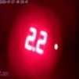

# seven-seg-ocr

**Blur-robust OCR for 7-segment LED/LCD displays — reading digits and error codes from water pressure relay cameras.**

No machine learning. No GPU. Pure NumPy + OpenCV image processing that works on blurry, low-resolution photos where Tesseract and template matching fail.

Built for reading values from a water pressure relay's 7-segment display captured through a monitoring camera — handles blur, uneven brightness, and mild skew typical of real-world snapshots.

## Example

A 101×101 px photo from the relay camera:



```bash
$ seven-seg-ocr tests/fixtures/test_2_2.jpg
Reading:  2.2
Format:  D.D
Confidence: 0.939
```

## How It Works

1. **Gradient edge detection** — finds digit boundaries even when blur merges segments
2. **3×3 zone analysis** — divides each digit into a 9-cell grid and measures brightness
3. **Correlation matching** — compares the zone profile against calibrated reference signatures
4. **Format constraints** — uses display context (D.D or LD) to eliminate ambiguities

## Installation

```bash
pip install seven-seg-ocr
```

Or from source:

```bash
git clone https://github.com/kotborealis/seven-seg-ocr.git
cd seven-seg-ocr
pip install -e ".[dev]"
```

## Quick Start

### Python API

```python
from seven_seg_ocr import read_display

result = read_display("photo.jpg")
print(result["reading"])   # "2.2"
print(result["confidence"]) # 0.386
print(result["format"])    # "D.D"
```

### Command Line

```bash
seven-seg-ocr photo.jpg
# Reading:  2.2
# Format:  D.D
# Confidence: 0.386

seven-seg-ocr photo.jpg --json
# {"reading": "2.2", "confidence": 0.386, ...}

seven-seg-ocr photo.jpg -p 32,48   # manual positions
```

## Supported Characters

| Format | Pattern | Examples |
|--------|---------|----------|
| D.D | Digit `.` Digit | `2.2`, `3.5`, `1.0` |
| LD | Hex letter + Digit | `A1`, `b3`, `C7` |

**Digits (0–9):** `0 1 2 3 4 5 6 7 8 9`
**Hex letters (A–F):** `A b C d E F`

## API Reference

### `read_display(image_path, **options)`

```python
def read_display(
    image_path: str | None = None,
    image_array: np.ndarray | None = None,
    *,
    y: int | None = None,        # top of digit band (auto-detected)
    dh: int = 35,                 # digit height in pixels
    window_w: int = 14,           # classification window width
    positions: list[int] | None = None,  # manual x-positions
    n_digits: int = 2,            # expected digit count
) -> dict
```

Returns:
```python
{
    "reading": "2.2",           # recognized string
    "format": "D.D",            # "D.D" or "LD"
    "confidence": 0.386,        # mean correlation [0..1]
    "details": [                # per-position breakdown
        ("2", 0.394, [("2", 0.394), ("3", 0.339), ("1", 0.326)]),
        (".", 1.0,   [(".", 1.0)]),
        ("2", 0.377, [("2", 0.377), ("3", 0.162), ("8", 0.110)]),
    ],
}
```

### Low-level functions

```python
from seven_seg_ocr import find_digits, classify, extract_zones

# Find digit positions from gradient edges
positions = find_digits(gray_image, y=33, dh=35)
# → [(32, 14), (45, 14), ...]

# Extract 3×3 zone brightness
zones = extract_zones(gray_image, x1=32, y1=33, dw=14, dh=35)

# Classify from zones
char, confidence, top3 = classify(zones, allowed_chars=["0","1","2","3","4","5","6","7","8","9"])
```

## How It Compares

| Method | Blurry 101×101 "2.2" | Notes |
|--------|----------------------|-------|
| Tesseract OCR | `2` or `3` | Fails on 7-segment fonts |
| Template matching | `3.6` or `dF` | Templates too clean vs blur |
| Brightness thresholding | `3.6` | Bloom merges segments |
| **seven-seg-ocr** | **`2.2`** | Gradient edges + zone correlation |

## Limitations

- Designed for **2-character displays** (D.D or LD format)
- Best results with images where digits span ≥12px width
- Heavy perspective distortion will reduce accuracy (mild skew is OK)
- Not for 14-segment, dot-matrix, or LCD with custom fonts

## Development

```bash
pip install -e ".[dev]"
pytest                      # run tests
ruff check src/ tests/      # lint
ruff format src/ tests/     # format
```

## License

MIT
